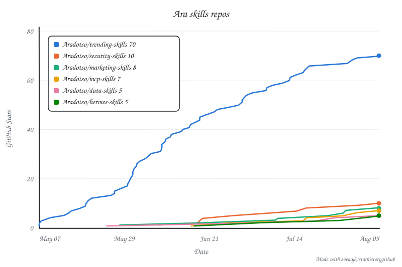

# starhistorygithub

GitHub star-history charts from the terminal, with **multi-repo comparison on one axis**.

```bash
pipx install git+https://github.com/svemyh/starhistorygithub
starhistorygithub chart myorg/repo-a myorg/repo-b myorg/repo-c
```



Python 3.10+, **zero dependencies**. Stdlib only, because this handles a GitHub token.

## Why

GitHub [restricted the stargazers API](https://github.blog/changelog/2026-06-30-upcoming-access-restrictions-to-public-api-endpoints-and-ui-views/)
on 2026-06-30 to repo admins and collaborators, which broke every hosted chart
service. Good local replacements appeared, but they all render **one repo per
chart**. This one puts them on a shared axis.

## Auth

Already use `gh`? Nothing to do, the token is borrowed automatically. Otherwise:

```bash
starhistorygithub auth login                        # prompts, hidden input
starhistorygithub auth status --repo myorg/myrepo   # who am I, and can I read this repo?
starhistorygithub auth logout
```

Verified before storing, kept in the macOS Keychain or a `0600` file.
Order: `--token` > `$STARHISTORYGITHUB_TOKEN` > `$GITHUB_TOKEN` > stored > `gh`.
Scope: `public_repo` is enough.

## Usage

```bash
starhistorygithub chart myorg/a myorg/b            # several repos, one axis
starhistorygithub chart myorg/a myorg/b --type timeline   # aligned from each first star
starhistorygithub chart myorg/a --dark --style clean
starhistorygithub export myorg/a -f csv -o stars.csv
```

| Flag | Default | |
|---|---|---|
| `-o, --output` | `<repo>.svg` | |
| `--title` | `Star History` | |
| `--style` | `xkcd` | or `clean` |
| `--type` | `date` | or `timeline` (days since each repo's first star) |
| `--dark` | off | |
| `--width` / `--height` | `800` / `533` | |
| `--color` | palette | repeatable, in repo order |
| `--no-cache` | off | curves cached 6h in `~/.cache/starhistorygithub` |
| `--no-attribution` | off | |

Output is a self-contained SVG with the font embedded, and rendering is
deterministic, so a scheduled re-render produces no diff unless stars moved.

```html
<picture>
  <source media="(prefers-color-scheme: dark)" srcset="stars-dark.svg">
  
</picture>
```

## Limits

- **Only repos you administer.** GitHub's restriction. Others return 404, and the error says so.
- **Above 40,000 stars the curve is interpolated.** GitHub paginates at 400x100; it samples, anchors to the live count, and tells you.
- **Eight repos max**, after which colours stop being distinguishable.
- **Unstars are invisible**, as with anything reconstructing from `starred_at`.

## Development

```bash
python3 -m unittest discover -s tests   # 27 tests, no network, no Keychain
```

## Prior art

[star-history.com](https://star-history.com) (the look; no CLI) ·
[mystarhistory](https://github.com/carsteneu/mystarhistory) (single repo, via `gh`) ·
[dtolnay/star-history](https://github.com/dtolnay/star-history) (Rust, D3) ·
[gh-star-history](https://github.com/ykdojo/gh-star-history) (Plotly, region breakdown)

## Licence

MIT. Bundles [Handlee](https://fonts.google.com/specimen/Handlee) under the SIL OFL.
